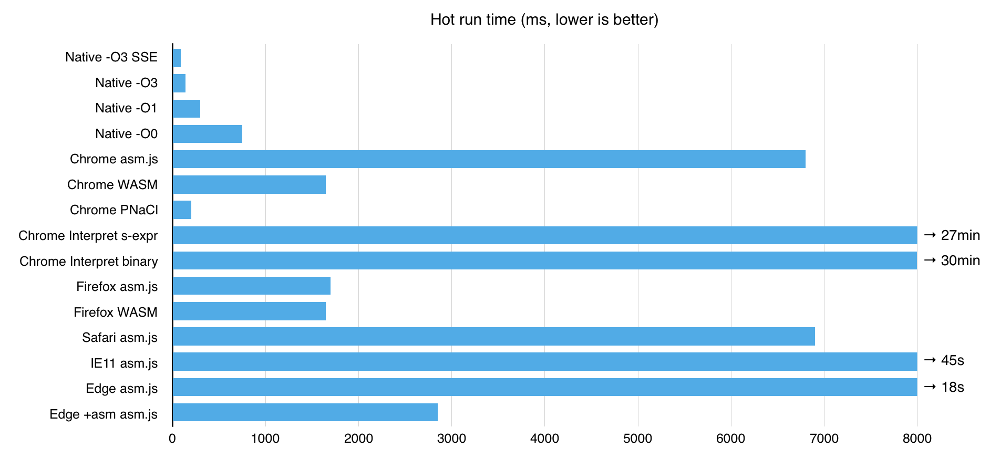
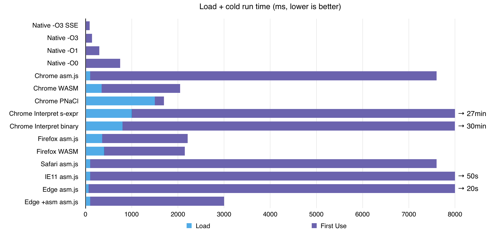
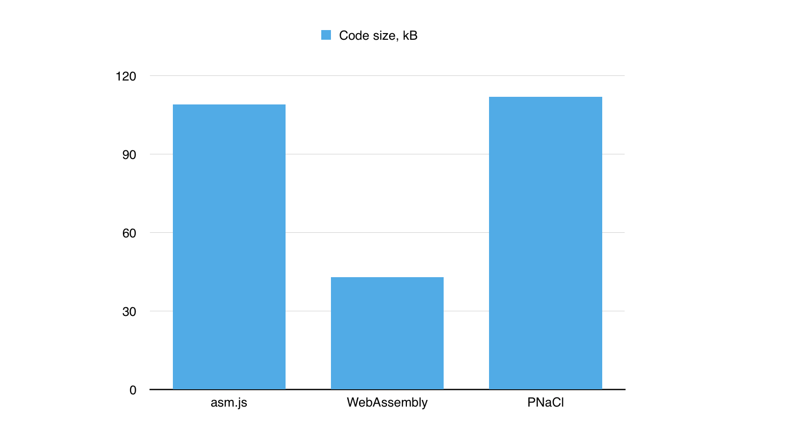

# Argon2 in browser

Argon2 is a password-hashing function, the winner of Password Hashing Competition. Here, Argon2 library is compiled for browser runtime.

[Live demo](https://antelle.github.io/argon2-browser)

[More about Argon2](https://github.com/P-H-C/phc-winner-argon2)

## The numbers

To cut it short, here are the numbers.

Code run time:



Init time + first run time:



## Numbers in table (ms, lower is better)

|                         | Load | First Use | Second Use |
|-------------------------|------|-----------|------------|
| Native -O3 SSE          | 0    | 90        | 90         |
| Native -O3              | 0    | 140       | 140        |
| Native -O1              | 0    | 300       | 300        |
| Native -O0              | 0    | 750       | 750        |
| Chrome asm.js           | 100  | 7500      | 6800       |
| Chrome WASM             | 350  | 1700      | 1650       |
| Chrome PNaCl            | 1500 | 200       | 200        |
| Chrome Interpret s-expr | 1000 | 1650000   | 1650000    |
| Chrome Interpret binary | 800  | 1800000   | 1800000    |
| Firefox asm.js          | 360  | 1850      | 1700       |
| Firefox WASM            | 400  | 1750      | 1650       |
| Safari asm.js           | 100  | 7500      | 6900       |
| IE11 asm.js             | 100  | 52000     | 47000      |
| Edge asm.js             | 65   | 19500     | 18000      |
| Edge +asm asm.js        | 100  | 2900      | 2850       |

## Test Environment

Environment used to get the numbers above:

Algorithm parameters (`-d -t 100 -m 10 -p 1`):
- iterations: 100
- memory: 1MiB (1024 KiB)
- hash length: 32
- parallelism: 1
- argon2d

Environment:

- MacBook pro, Intel Core i5, 2.5GHz (x64)
- Chrome 55.0.2843.0 (Official Build) canary (64-bit), V8 5.5.1
- Firefox Nightly 51.0a1 (2016-08-29)
- IE11 and Edge on Windows 10 (x64, Bootcamp)
- native argon2 compiled from https://github.com/P-H-C/phc-winner-argon2 @4844d2f

## Code size

It's hard to measure WebAssembly code size because the project is not finished yet and the size of wrapper is rather large. So, we measure only binary file size (.wasm).



|             | Code size, kB | Comment    |
|-------------|---------------|------------|
| asm.js      | 109           | complete   |
| WebAssembly | 43            | only .wasm |
| PNaCl       | 112           | .pexe      |

## Is Argon2 modified?

Put it simply, it's the same. Some changes were added, though, required to cope with WASM issues. You can always compare it with the original argon2 to check.

## Difficulties

Argon2 is using uint64, which is not supported by JavaScript.
This function is called ~30M times per one iteration:
```cpp
uint64_t fBlaMka(uint64_t x, uint64_t y) {
    const uint64_t m = UINT64_C(0xFFFFFFFF);
    const uint64_t xy = (x & m) * (y & m);
    return x + y + 2 * xy;
}
```

And this one:
```cpp
uint64_t rotr64(const uint64_t w, const unsigned c) {
    return (w >> c) | (w << (64 - c));
}
```

In C++, we can make use of SSE for 64-bit arithmetics. In browser, when no 64-bit unsigned integer type is available, different engines have different time penalties of this operation.

## JS Library

Until WASM is mature, js library is using only asm.js at the moment. Here's how to try it.

Install with bower:
```bash
bower install argon2-browser
```

Add script to your HTML:
```html
<script src="bower_components/argon2-browser/lib/argon2.js"></script>
```

Calculate the hash:
```javascript
argon2.hash({ pass: 'password', salt: 'somesalt' })
    .then(h => console.log(h.hash, h.hashHex, h.encoded))
    .catch(e => console.error(e.message, e.code))
```

Bring your own bundler and promise polyfill.  
Other parameters:
```javascript
argon2.hash({
    // required
    pass: 'password',
    salt: 'salt',
    // optional
    time: 1, // the number of iterations
    mem: 1024, // used memory, in KiB
    hashLen: 24, // desired hash length
    parallelism: 1, // desired parallelism (will be computed in parallel only for PNaCl)
    type: argon2.ArgonType.Argon2d, // or argon2.ArgonType.Argon2i
    distPath: '' // asm.js script location, without trailing slash
})
// result
.then(res => {
    res.hash // hash as Uint8Array
    res.hashHex // hash as hex-string
    res.encoded // encoded hash, as required by argon2
})
// or error
.catch(err => {
    err.message // error message as string, if available
    err.code // numeric error code
})
```

## Node.js support

Of course, you can use generated asm.js code in node.js but it's not sensible: you will get much better speed by compiling native node.js addon, which is not that hard. Wait, it's already done, just install [this package](https://github.com/ranisalt/node-argon2).

## Is it used anywhere?

It will be! Argon2 was compiled for [KeeWeb](https://github.com/keeweb/keeweb) project (web-based password manager) and will be used in the next version.

Now it's just an experiment. Feel free to checkout and play with it.

## License

[MIT](https://opensource.org/licenses/MIT)
